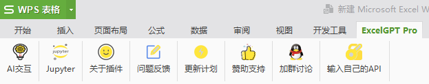

# ExcelGPT 食用说明

> 插件发布页 [小众软件](https://meta.appinn.net/t/topic/43611)

> 插件更新地址 [蓝奏云](https://ifwz.lanzouw.com/b07dbq48f)  密码：6666

## 安装插件

WPS版

开发工具——加载项——浏览，选择xll插件即可

安装成功，会在工具栏显示

## 基础使用方法

单元格中输入=AI()即可食用

## 使用自己的key和代理

插件内置接口，如果接口不能使用，可尝试切换潘多拉或chatanywhere接口

点击**输入自己的API**按钮，在对话框中输入key和代理

视频演示

<iframe frameborder="0" src="https://api.paugram.com/bili?bv=BV1V14y1173C&style=gray" style="height: 160px; width: 100%"></iframe>

