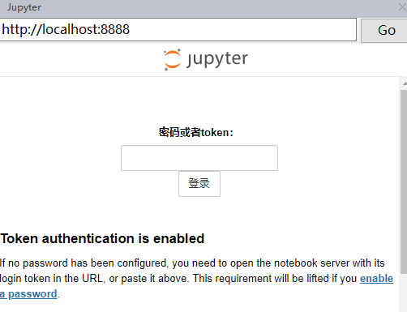
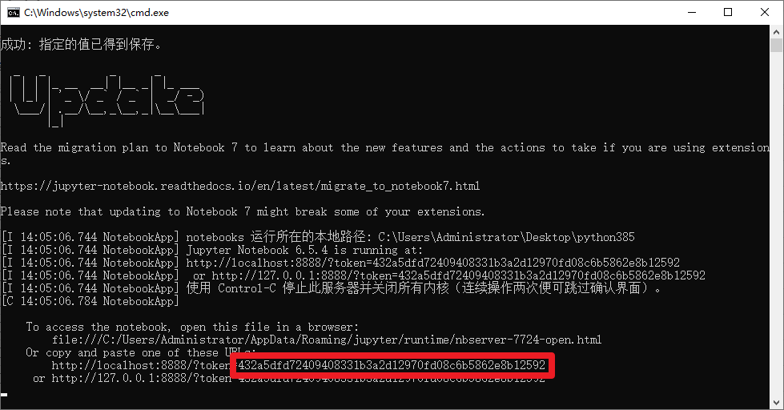
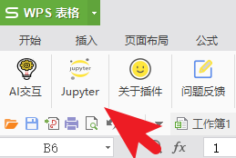
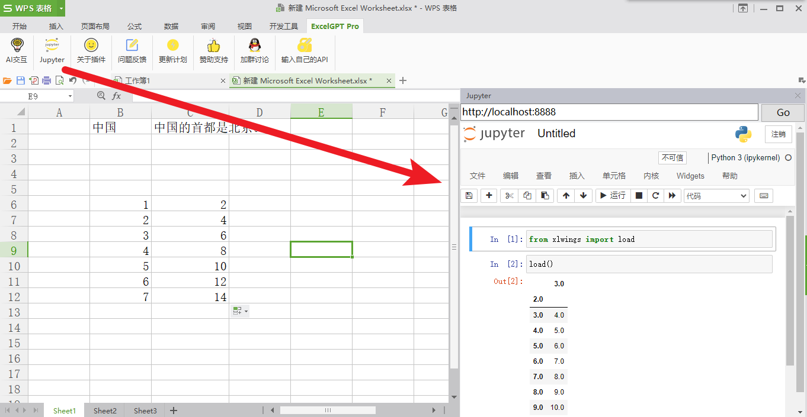
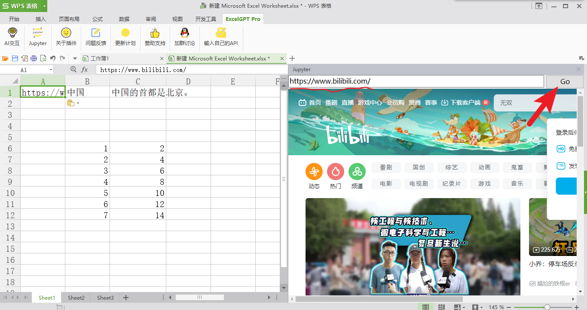
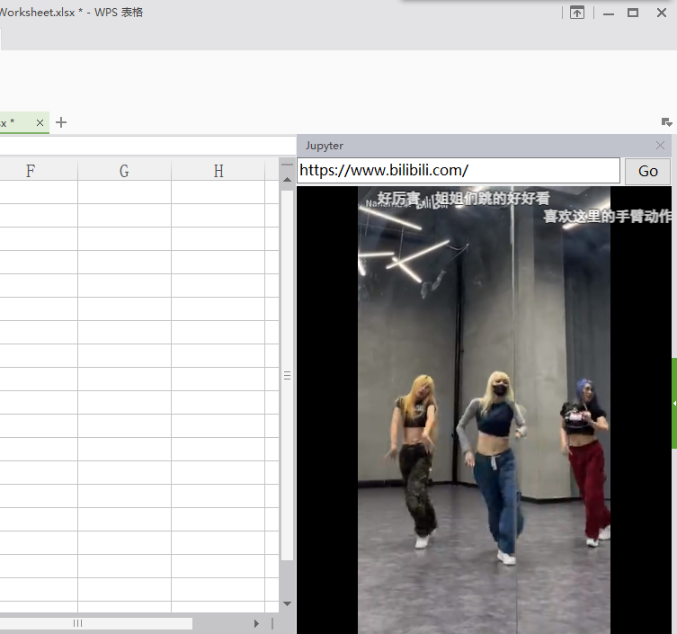

# Jupyter界面入门

在ExcelGPT Pro版中，增加了在侧边栏打开jupyter界面的功能

通过xlwings库实现使用python代码操控表格、绘制图表等功能

## 下载python环境

我提供了一个免安装的配置好jupyter环境的压缩包，大家下载下来解压即可食用

或者，你是python的熟练用户，自行安装python、搭建jupyter环境

[python环境下载](https://www.123pan.com/s/HRY9-jnoVv.html)

## 运行jupyter服务

不了解jupyter的同学，可以把jupyter看成一个可以分段式运行python代码的记事本 

下载好python环境的压缩包，解压

双击运行，一键启动.bat

浏览器打开 http://localhost:8888/

如果出现要求输入密码

到cmd窗口查看，复制token后的乱码，这个就是登录密码

## 安装Edge运行环境

由于是使用webview2技术实现的在侧边栏显示jupyter界面，所以需要Edge运行环境

如果，你的电脑使用的是win10或11，并且自带Edge浏览器，就不需要下载运行环境了

Edge运行环境下载：

[win10/11](https://developer.microsoft.com/en-us/microsoft-edge/webview2/) 

[win7](https://www.lanzouv.com/b086mt6gd)  密码：cyxt 

## 打开jupyter界面

点击左起第二个**jupyter**图标

在侧边栏就会出现jupyter界面啦！

侧边栏其实相当于一个浏览器，我们输入网址，可以在上班时偷偷摸鱼看B站

